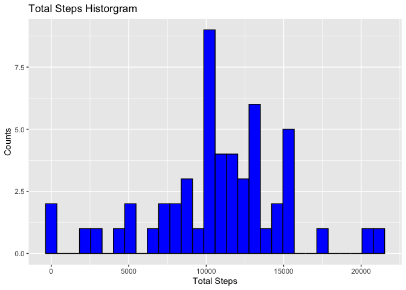
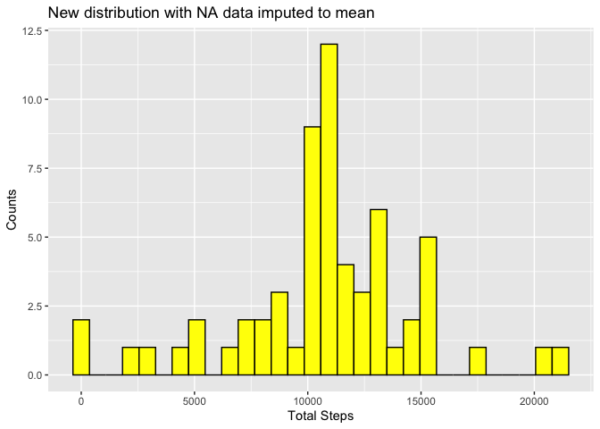
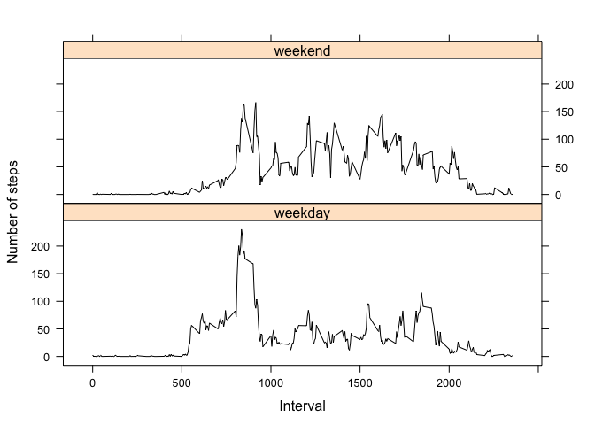

## Introduction
It is now possible to collect a large amount of data about personal movement using activity monitoring devices such as a Fitbit, Nike Fuelband, or Jawbone Up. These type of devices are part of the “quantified self” movement – a group of enthusiasts who take measurements about themselves regularly to improve their health, to find patterns in their behavior, or because they are tech geeks. But these data remain under-utilized both because the raw data are hard to obtain and there is a lack of statistical methods and software for processing and interpreting the data.

This assignment makes use of data from a personal activity monitoring device. This device collects data at 5 minute intervals through out the day. The data consists of two months of data from an anonymous individual collected during the months of October and November, 2012 and include the number of steps taken in 5 minute intervals each day.

The data for this assignment can be downloaded from the course web site:

* Dataset: [Activity monitoring data](https://d396qusza40orc.cloudfront.net/repdata%2Fdata%2Factivity.zip) 

The variables included in this dataset are:

* steps: Number of steps taking in a 5-minute interval (missing values are coded as 𝙽𝙰) </br>
* date: The date on which the measurement was taken in YYYY-MM-DD format </br>
* interval: Identifier for the 5-minute interval in which measurement was taken </br>
The dataset is stored in a comma-separated-value (CSV) file and there are a total of 17,568 observations in this dataset. 

## Assignment Instructions

1. Code for reading in the dataset and/or processing the data
2. Histogram of the total number of steps taken each day
3. Mean and median number of steps taken each day
4. Time series plot of the average number of steps taken
5. The 5-minute interval that, on average, contains the maximum number of steps
6. Code to describe and show a strategy for imputing missing data
7. Histogram of the total number of steps taken each day after missing values are imputed
8. Panel plot comparing the average number of steps taken per 5-minute interval across weekdays and weekends
9. All of the R code needed to reproduce the results (numbers, plots, etc.) in the report

## Loading and preprocessing the data

First thing to do is to load and explore data provided in zip file

```r
## Step 1
## Code for reading in the dataset and/or processing the data
unzip("activity.zip")
dataTypes = c("integer", "character", "integer")
data <- read.csv("activity.csv", head=TRUE, colClasses=dataTypes, na.strings="NA")
head(data)
```

```
##   steps       date interval
## 1    NA 2012-10-01        0
## 2    NA 2012-10-01        5
## 3    NA 2012-10-01       10
## 4    NA 2012-10-01       15
## 5    NA 2012-10-01       20
## 6    NA 2012-10-01       25
```

```r
str(data)
```

```
## 'data.frame':	17568 obs. of  3 variables:
##  $ steps   : int  NA NA NA NA NA NA NA NA NA NA ...
##  $ date    : chr  "2012-10-01" "2012-10-01" "2012-10-01" "2012-10-01" ...
##  $ interval: int  0 5 10 15 20 25 30 35 40 45 ...
```

```r
names(data)
```

```
## [1] "steps"    "date"     "interval"
```

Once we hace an idea or our dataset, second thing is to remove missing values and correct type of date colums for later analysis


```r
data$date <- as.Date(data$date)
dataProcessed <- subset(data, !is.na(data$steps))
```

## What is mean total number of steps taken per day?


```r
## Step 2
## Histogram of the total number of steps taken each day
library(ggplot2)
dataSummed<-data.frame(tapply(dataProcessed$steps,dataProcessed$date,sum,na.rm=TRUE))
dataSummed$date<-rownames(dataSummed)

#Histogram of total steps
qplot(dataSummed[[1]],geom="histogram",fill=I("blue"),col=I("black"),
      xlab="Total Steps",ylab="Counts",main="Total Steps Historgram")
```

```
## `stat_bin()` using `bins = 30`. Pick better value with `binwidth`.
```

<!-- -->

```r
png("plot1.png")
dev.off()
```

```
## quartz_off_screen 
##                 2
```

```r
##Step 3
##Mean and median number of steps taken each day
mean(dataSummed[[1]])
```

```
## [1] 10766.19
```

```r
median(dataSummed[[1]])
```

```
## [1] 10765
```

According to the results, the mean is 10766 steps and the median is 10765 steps.

## What is the average daily activity pattern?

```r
##Step 4
##Time series plot of the average number of steps taken
dataAvg <- tapply(dataProcessed$steps, dataProcessed$interval, mean, na.rm=TRUE, simplify=T)
df_dataAvg <- data.frame(interval=as.integer(names(dataAvg)), avg=dataAvg)

with(df_dataAvg,
     plot(interval,
          avg,
          type="l",
          xlab="5-minute intervals",
          ylab="average steps in the interval across all days"))
```

<!-- -->


```r
##Step 5
##The 5-minute interval that, on average, contains the maximum number of steps
max_steps <- max(df_dataAvg$avg)
df_dataAvg[df_dataAvg$avg == max_steps, ]
```

```
##     interval      avg
## 835      835 206.1698
```

So we can conclude that the interval 835 contains the maximum number of steps,206

## Imputing missing values
First we take note of the original number of missing values

```r
sum(is.na(data$steps))
```

```
## [1] 2304
```

My strategy will be to fill in all of the NA's with a mean value for the interval of that missing value.</br>
Therefore, I need to create a new dataFrame similar to the original one but with all NA filled in

```r
##Step 6
##Code to describe and show a strategy for imputing missing data
dataFilledNA <- data
noData <- is.na(dataFilledNA$steps)
dataAvg <- tapply(dataProcessed$steps, dataProcessed$interval, mean, na.rm=TRUE, simplify=T)
dataFilledNA$steps[noData] <- dataAvg[as.character(dataFilledNA$interval[noData])]
```

Now, since I have filled missing values,I can make the new histogram and check differences


```r
## Step 7
##Histogram of the total number of steps taken each day after missing values are imputed
library(ggplot2)
dataFilledNASummed <- data.frame(tapply(dataFilledNA$steps, dataFilledNA$date, sum, na.rm=TRUE, simplify=T))

dataFilledNASummed$date<-rownames(dataFilledNASummed)

#Histogram of total steps
qplot(dataFilledNASummed[[1]],geom="histogram",fill=I("yellow"),col=I("black"),
      xlab="Total Steps",ylab="Counts",main="New distribution with NA data imputed to mean")
```

```
## `stat_bin()` using `bins = 30`. Pick better value with `binwidth`.
```

<!-- -->

```r
png("plot2.png")
dev.off()
```

```
## quartz_off_screen 
##                 2
```

Let's check new means and compare to previous one (NA's vs no NA's)

```r
mean(dataSummed[[1]])
```

```
## [1] 10766.19
```

```r
mean(dataFilledNASummed[[1]])
```

```
## [1] 10766.19
```

```r
median(dataSummed[[1]])
```

```
## [1] 10765
```

```r
median(dataFilledNASummed[[1]])
```

```
## [1] 10766.19
```

*Conclussion: The mean doesn't change, and the median has an insignificant change. Actually, new median is equal to mean as a result of filling the missing data for the intervals with means.</br>

We can also see, as a consecuence, higher frequency counts in the histogram at the center region (blue histogram plot at the beginning has a lower y-axis).

## Are there differences in activity patterns between weekdays and weekends?

# helper function to decide if a day is a week day or not

```r
isWeekend <- function(d) {
    days <- weekdays(d)
    ifelse (days == "sábado" | days == "domingo", "weekend", "weekday")
}

dayType <- sapply(dataFilledNA$date, isWeekend)
dataFilledNA$dayType <- as.factor(dayType)
head(dataFilledNA,2)
```

```
##       steps       date interval dayType
## 1 1.7169811 2012-10-01        0 weekday
## 2 0.3396226 2012-10-01        5 weekday
```

Once we have our data ready to compare, let's compare difference between weekdays and weekend


```r
## Step 8
##Panel plot comparing the average number of steps taken per 5-minute interval across weekdays and 

dataToPlot <- aggregate(steps ~ dayType+interval, data=dataFilledNA, FUN=mean)

library(lattice)

xyplot(steps ~ interval | factor(dayType),
       layout = c(1, 2),
       xlab="Interval",
       ylab="Number of steps",
       type="l",
       lty=1,
       col = "black",
       data=dataToPlot)
```

<!-- -->

As we may expect, in weekdays when people is more likely to have to work, sport activities start early in the morning. Moreover, we can see higher activity levels in weekends during all day.
